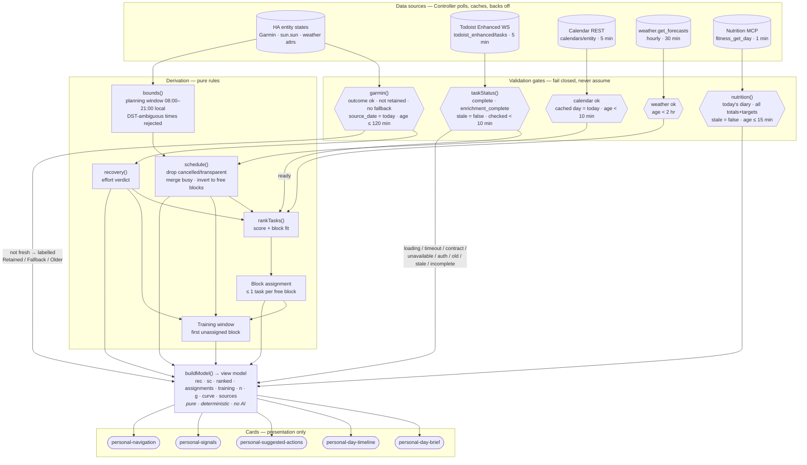
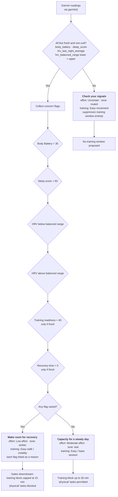
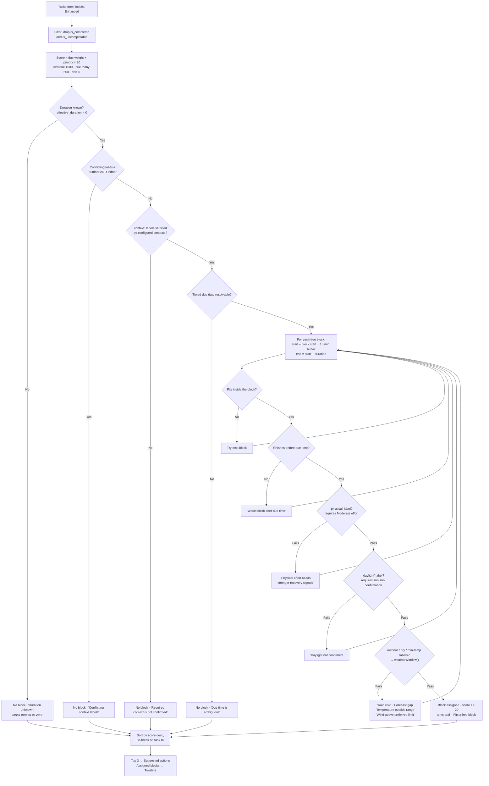

# Decision flow

How the rule-based logic in `src/model.mjs` turns Home Assistant data into what the cards display. All of it is deterministic: no AI model, no inference service, no randomness.

## Overall pipeline

Every unavailable or unverified input degrades to an explicit labelled state. Nothing is silently assumed: no free time, no zero duration, no strong recommendation.

## Recovery verdict

`recovery()` in `src/model.mjs`.

These are prototype planning cues, not medical thresholds or Garmin prescriptions.

## Task ranking and block fit

`rankTasks()` in `src/model.mjs`.

Suggestions are tentative. They do not reserve time, create calendar events or mutate Todoist.
